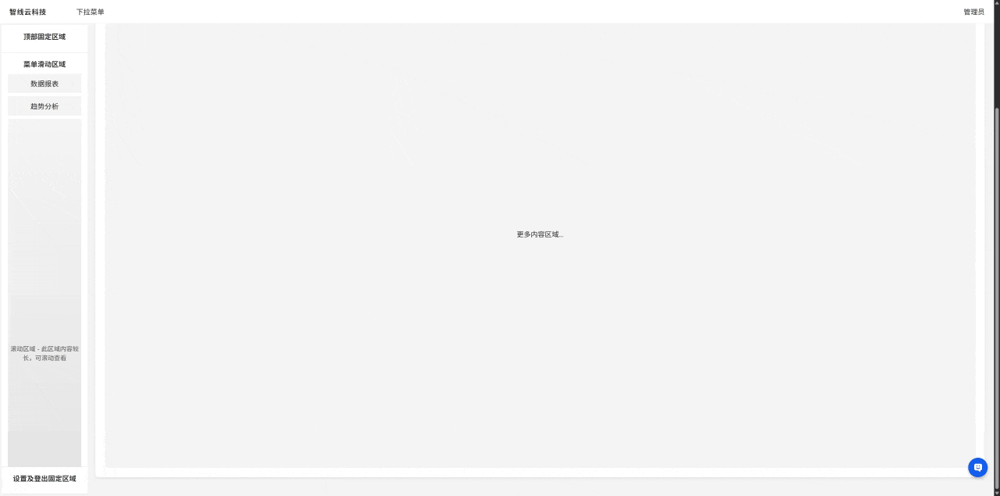
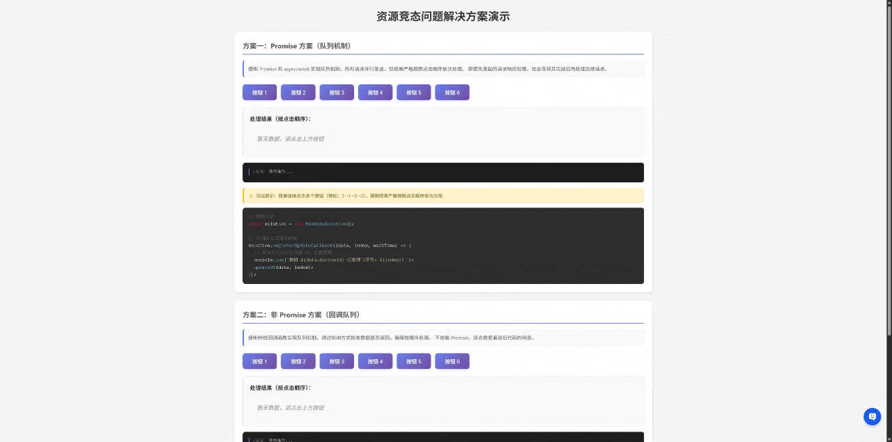

# 页面布局问题

## 问题分析

1. 整个 UI（出内容区域外）需要占满整个 PC 屏幕，所以宽高均为 100%

2. 下拉菜单层级设置需要跟随按钮走，一般将按钮容器设置为相对布局，菜单为绝对布局，并设置 zindex，以确保浮层正确

3. 内容区滚动容器必须是 body，那么:

- Header 和 Silder 则需要设置为 fixed，以确保内容区滚动时，Header 和 Silder 不随内容区滚动
- body 设置 padding-top 和 padding-left，用于避免 body 内容区与 Header 和 Silder 重叠
- 设置 Overflow：auto，用于支持内容元素滚动

4. Silder 纵向是撑满除 Header 外的高度，首尾固定，中间自动撑满（隐藏滚动条） 5. 下拉支持支持动画（透明度 + 过渡动画），保证有序性
   动画持续时长可自行调整至合适长度，但从菜单项一到菜单项四，要保证动画的有序性

### 编码实现

- **代码文件**：[HTML 布局](./HTML布局/index.html)
- **案例录像**：

## # 资源静态问题

## 问题描述

您正在开发一个 Web 应用，用户界面上有多个按钮（例如按钮 1、2、3 等）。每个按钮点击会触发一个异步请求（例
如从服务器获取数据），并且用户可以以任意顺序点击这些按钮。最终，系统需要按照用户点击的顺序处理这些请求的返回
数据，并将数据按顺序存储在一个数组中，用于后续的界面更新（例如更新 canvas 画面）。
注意：
● 用户点得很快，需要避开竞态问题，结果返回的顺序影响 UI 渲染结果
● 应支持 N 个按钮的这种并发处理，每次连点，都会触发一次 UI 更新
● 请求应该并行发送，结果应该串行返回，每次返回结果，用户都能看到 UI 的变化效果，像动画一样
● 请使用 Promise 和 非 Promise 两种方案解决，注意这里 Promise 不是 xhr/fetch 的简单封装，而是解决竞态问题的方法

## 问题需求拆解

1. 当前有多个按钮，用户点击按钮，触发异步请求

2. 用户可能快速连续点击多个按钮，请求并行发出，但返回的结果则需要按照用户点击顺序处理，并且收到结果后更新 UI

3. 异步多次点击，并行请求发出，需要解决静态问题

4. Promise/非 Promise 两种方案实现

## 问题分析

1. 因为要保持异步请求返回结果的处理顺序，则为一个队列，用于保存每个请求和序列号
2. 每产生一个请求任务后，就将任务放到任务队列中，附带请求的序号，用于按照顺序保存结果
3. 请求发出后，需要将任务从队列中移除，并将任务序号保存到一个数组中，用于后续的 UI 更新

4. 核心问题是，请求可以异步发送，需要按照顺序保存请求的结果，并且按照顺序前面的请求结果返回后，才能更新 UI，继而更新下一个请求的结果

场景轴如下：

// 场景：用户依次点击按钮 3 → 1 → 5 → 2
// 时间轴：
// T0: 点击 3 → 立即发起请求 3 → 加入队列
// T0.1: 点击 1 → 立即发起请求 1 → 加入队列
// T0.2: 点击 5 → 立即发起请求 5 → 加入队列
// T0.3: 点击 2 → 立即发起请求 2 → 加入队列
// T3: 请求 3 返回 → 立即处理（动画 1）
// T2.5: 请求 1 返回 → 等待 3 处理完 → 处理（动画 2）
// T4: 请求 5 返回 → 等待 1 处理完 → 处理（动画 3）
// T3.5: 请求 2 返回 → 等待 5 处理完 → 处理（动画 4）

- **代码文件**

[资源竞态问题](./资源竞态问题/index.html)

```html
<p align="center">
  
</p>
```

## 第三题（非必答）

# 多 Iframe 页面通信问题

## 问题分析

由于是多个 iframe 页面之间的通信，存在跨域问题，那就只能通过 postMessage 实现，思路如下：

- 获取每个 iframe 示例，如为 Iframe 标签添加 ID 属性，以方便获取 iframe 元素实例
- 使用 postMessage 在主页面中监听 iframe 的消息，并根据 iframe 的 ID 属性进行处理

- **代码文件**

[多 Iframe 通信](./多Iframe通信/main.html)

```html
<p align="center">
  
</p>
```

## 批量下载管理器

通过分析题目是需要实现一个批量下载管理器，需要实现如下功能：

- 从 OSS 下载文件，使用 Fetch API + ReadableStream，在客户端读取流式文件内容，并使用 FileSaver.js 保存到本地
- 支持多文件并发下载，并显示下载进度
- 支持暂停、继续、取消下载
- 支持下载失败重试

在前端实现文件的基本管理，这里不使用 Worker 的原因是，文件下载属于 IO 密集型操作，而不属于 CPU 密集型操作，对 CPU 的占用率不高，使用 Worker 反而会增加 CPU 的占用率，导致页面卡顿，影响用户体验

- **代码文件**

[下载管理器](./下载管理器/main.html)

```html
<p align="center">
  
</p>
```

## 关于 AI 分析的优缺点分析

题目中的第二题使用了 AI 辅助分析设计思路编码实现，第三、第四题目则是使用 AI 实现，也同样由 AI 筛选设计思路与实现方案，人工 Review 代码逻辑。

AI 分析会参考网络资料快速生成场景示例，并提取中重点关注的特性和细节问题，必要时会给出流程图，以便能够快速了解内部实现流程

优点：

1. 相比较与人工分析，AI 分析的更加透彻和快捷，补充的案例也很完善，并针对应用场景会做发散性提醒，可以选择在某个场景下更加精细化的实现
2. 在测试验证场景，如 API 验证、业务需求方案验证等，均可以使用 AI 快速生成验证方案，并进行验证，以保证方案的可行性与可靠性，例如上述题目的测试验证大量参考 AI 辅助生成，从而确保逻辑正确

缺点：

1.AI 分析的缺点也很明显，如果没有确定用户角色（如限定高级/资深架构师），可能会生成小白代码，实现方式有待优化，边界模拟模糊，需要补充完整的上下文用于优化输出结果 2.在部分场景中，AI 的回答结果可能会出现幻觉（并不是最新的回答），例如在以往的开源库 LangChain 的实现案例中，导出的包并不是最新的或者路径错误，需要不断调整提示词进行场景边界优化，才能得到想要的结果

总体来说，AI 目前对编程的辅助参考案例解析都非常方便，可以帮助完成大部分代码的输出，研发的中心可能需要迁移到对代码实现逻辑的审核，以确定是否符合当前业务场景，Review 的耗时会比较多

## 日常 AI 的应用场景

- 项目开发工具函数的辅助生成

在以往的开发项目中，通常对工具函数或组件，仅提供注释描述，使用 Github Copilot 可以快速生成代码实现，并进行 Review，以保证代码的正确性与可读性

- 业务场景的方案可行性验证

如在过往的用户浏览器 WebRTC 直播推流的调研中，利用 Cursorke 可以快速生成代码实现，进行方案可行性验证，以保证场景可行与可靠性，包括如下方案验证：

- 验证摄像头、桌面共享媒体流 WebRTC 腾讯云推流，前端画中画合成， 包括 PC 端和 H5 端，并验证各个浏览器的兼容性，
- 验证画布白板的流转换，与摄像头的合流问题
- 基于 LangChain 的本地 AI 工具对话与 RAG 知识库的应用验证，接入 LLM（如 Deepseek Chat）实现个人 Agent

在以往项目业务场景中，AI 的作用越来越明显，可以帮助完成大部分代码的输出，同时也需要对代码进行 Review，以保证代码的正确性与可读性
